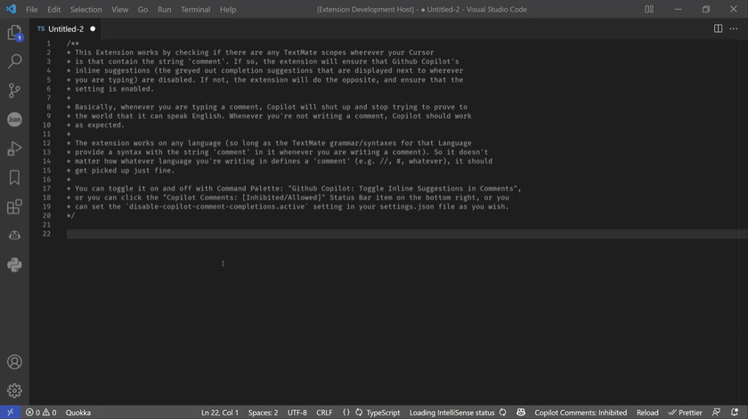

[VSCode Extension Marketplace Download](https://marketplace.visualstudio.com/items?itemName=disable-copilot-comment-completions.disable-copilot-comment-completions)

## Features

Prevents Github Copilot from providing inline suggestions in comments (and anywhere else you might not want copilot to be providing suggestions).

Can be used to define "exclusion rules" that instruct the Extension to temporarily disable Copilot's inline suggestions feature when certain strings of text from the document itself are matched at the cursor position, or when certain glob patterns match the active document, or when certain TextMate scopes are found at the cursor position.

Some example use cases / configurations include:
- [Using a glob pattern rule to disable inline suggestions when editing commit messages](https://github.com/jamesonknutson/disable-copilot-comment-completions/issues/5)
```json
{
  "disable-copilot-comment-completions.globPatternRules": [
    "**/COMMIT_EDITMSG"
  ]
}
```
- Using a text mate rule to disable inline suggestions when writing comments
```json
{
  "disable-copilot-comment-completions.textMateRules": [
    {
      "type": "string",
      "value": "comment",
      "mode": "includes"
    }
  ]
}
```
- If you have further use case examples, please submit an issue so I can include it here

The extension works by listening to VSCode's [`onDidChangeTextEditorSelection` event](https://code.visualstudio.com/api/references/vscode-api#:~:text=onDidChangeTextEditorSelection) and iterating over all the configured 'exclusion rules' to determine whether or not copilot's inline suggestions should be artificially disabled by the extension at the current position. If so, the extension will disable inline suggestions until the inverse is true (none of the exclusion rules match), at which point inline suggestions will be enabled again.

The Extension can be toggled on or off using the `disable-copilot-comment-completions.toggle` Command (Command Palette: `Toggle Copilot Scope Inhibitor`), and/or set in your settings.json file using the setting key: `disable-copilot-comment-completions.active` (boolean). You can also force-enable/disable the Extension using the commands `disable-copilot-comment-completions.enable` and `disable-copilot-comment-completions.disable`.

For ease of use with TextMate Scopes, the extension provides an easy way to select TextMate Scopes to exclude selections within. You can run the `disable-copilot-comment-completions.addScopes` command whenever your cursor position is in some file that has a TextMate Grammar associated with it, and it will present you with a menu comprising of the TextMate Scopes at the cursor position to add/remove exclusion rules for.



[Demo also available here if the GIF isn't loading](https://gfycat.com/quaintplayfulharrierhawk)

## Requirements

1. [Github Copilot (obviously).](https://marketplace.visualstudio.com/items?itemName=GitHub.copilot)
2. [HyperScopes](https://marketplace.visualstudio.com/items?itemName=draivin.hscopes) - This extension is used to grab the scopes of wherever you're typing. You need to install it before this extension can work.

## Extension Settings

- `disable-copilot-comment-completions.active`: Enable or Disable this Extension (defaults to `true`).

- `disable-copilot-comment-completions.textMateRules`: Array of Match Rules that are evaluated against the TextMate Scopes at the active cursor position. This setting can be used to instruct the extension to disable suggestions when certain strings are found within (or regular expressions match) the TextMate Scopes at the active cursor.

- `disable-copilot-comment-completions.contentRules`: (Optional) Array of Match Rules that are evaluated against the Text Content surrounding the active cursor position. This setting can be used to instruct the extension to disable suggestions when certain strings of text are found within a certain distance from the caret position.

- `disable-copilot-comment-completions.eventProcessingThrottleDelayMs`: (Optional) A delay (in milliseconds) used as the minimum amount of time to wait between executions of the main logic of this extension. This extension uses some potentially expensive computations to determine if the cursor position is in an "excluded" region (namely the `textMateRules` setting, as the Extension has to re-tokenize the Document you're editing to figure out the Scopes at the cursor position). These expensive computations must be ran whenever the cursor position changes (e.g. typed a new letter, deleted a letter, navigated in any way inside the document, etc), and as such, this setting can be used to provide a minimum time to wait between re-running these expensive computations, so that the editor experience does not slow down to a crawl. **It is recommended that you leave this at the default setting of 500(ms)**, the throttle barely hurts the desired effects of this extension and greatly helps with performance.

- `disable-copilot-comment-completions.globPatternRules`: (Optional) Array of glob patterns to match against the path of active file. If any of the globs defined here matches the active file, Inline Suggestions will be inhibited. Uses [multimatch](https://www.npmjs.com/package/multimatch) under the hood, so any valid multimatch pattern will work here. This setting can be used to instruct the extension to disable suggestions when the path of the open file in the active Text Editor matches a certain glob pattern.

- `disable-copilot-comment-completions.debug`: Boolean indicating whether or not the extension should log what it's doing to an output channel.

## Example usage

Disable copilot on python and typescript imports by adding this to your `.vscode/settings.json`:
```json
  "disable-copilot-comment-completions.contentRules": [
    {
      "type": "string",
      "mode": "startsWith",
      "value": "import "
    },
    {
      "type": "string",
      "mode": "startsWith",
      "value": "from "
    }
  ],
  "disable-copilot-comment-completions.textMateRules": [
    {
      "type": "regexp",
      "value": {
        "source": "^meta\\.import\\.ts$"
      }
    },
    {
      "type": "regexp",
      "value": {
        "source": "^meta\\.import\\.py$"
      }
    }
  ],
```

## Commands

- `disable-copilot-comment-completions.toggle`: Toggles `disable-copilot-comment-completions.active` state (disables or enables the extension's functionality). You can bind this to a keyboard shortcut if you'd like. You can also disable/enable the extension by clicking the status bar item on the bottom right. (Command Palette: `Toggle Copilot Scope Inhibitor`)
- `disable-copilot-comment-completions.enable`: Sets `disable-copilot-comment-completions.active` to true (Command Palette: `Enable Copilot Scope Inhibitor`)
- `disable-copilot-comment-completions.disable`: Sets `disable-copilot-comment-completions.active` to false (Command Palette: `Disable Copilot Scope Inhibitor`)
- `disable-copilot-comment-completions.addScopes`: Opens quick picker to help you add new Scopes to inhibit completions within (Command Palette: `Add Scopes to Inhibit from Cursor`)

## Known Issues

- None (as of 2.0.0).

## Release Notes

See CHANGELOG.md for more details.

### 1.0.0

- Initial release. Fly, little angel, fly..., fly...

### 1.0.1

- Added new commands to force-disable and force-enable the extension
- [Added new option for user to configure the scopes they want github copilot suggestions to be disabled within](https://github.com/jamesonknutson/disable-copilot-comment-completions/issues/1)
- Added new command to help user pick scopes from the current selection to be disabled within
- Rewrote the extension using my now vastly superior understanding of Typescript (this was my first attempt at writing in Typescript, I have since gained a minimum of three months experience with it, so hey, it's about time for some house keeping right?), so hopefully it is now some mix of (A) more performant, (B) easier to read, (C) cleaner to edit, and/or (D) less buggy.

### 1.0.2

- Some minor bug fixes

### 2.0.0

- ⚠ **BREAKING CHANGE**: Removed the setting `disable-copilot-comment-completions.inhibitMatchers`, it's role is now accomplished by the `disable-copilot-comment-completions.textMateRules` setting.

- Extension fully re-written from the ground up, optimizing for performance and efficiency (internally, this is implemented in the form of intelligently caching results, amongst other things)

- Exclusion rules can now accept a variety of different evaluation modes, e.g. you can use RegExp (just as you could previously), as well as simple string comparison evaluation (e.g. `startsWith`, `endsWith`, `includes`, `equals`)


- Added new setting (`disable-copilot-comment-completions.textMateRules`), these rules are matched against the TextMate Scopes at the Cursor Position

- Added new setting (`disable-copilot-comment-completions.contentRules`), these rules are matched against the Text Content at the Cursor Position

- Added new setting (`disable-copilot-comment-completions.globPatternRules`), these rules are matched against the current Document's file path as Glob Patterns

- Added new setting (`disable-copilot-comment-completions.debug`), when set to true the Extension will output some logging information to the VSCode Output View (titled `Disable Copilot Suggestions`)

- Added new setting (`disable-copilot-comment-completions.eventProcessingThrottleDelayMs`), can be used to add a throttle to ignore selection change events that occur within <X> milliseconds of the last time the Extension evaluated it's exclusion rules. Seems to increase performance handsomely

- Added an Element to VSCode's Status Bar that indicates the current 'state' of the Extension (whether it is silencing Copilot's suggestions or not), you can hover over it for some limited information as to why it is doing whatever it is doing as well (intended mainly for quick debugging purposes when testing out new settings).

- Improved robustness of caching techniques used internally by the Extension to increase performance
